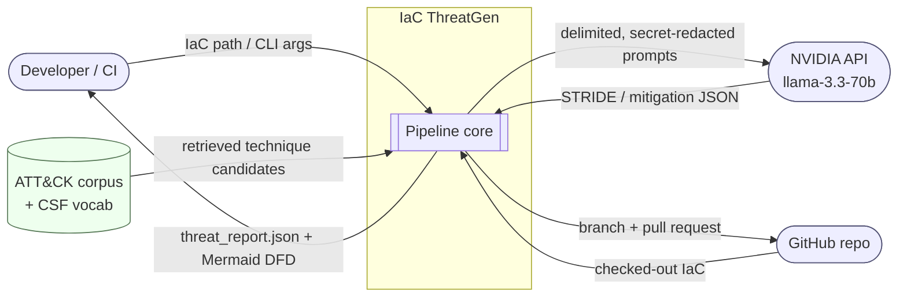

# Architecture & Design — IaC ThreatGen

**Phase 3 · Design**  |  **Role: Solutions Architect**  |  Date: 2026-06-16

This document defines the system architecture, the data-flow diagrams (Level 0/1), the
**LangGraph** agent topology and shared **state schema**, the **RAG** design (corpus +
retrieval backend), the **frozen dependency set**, and the security design. It builds directly
on the frozen contracts from Phase 2 ([resource_graph](../src/iac_threatgen/schemas/resource_graph.schema.json),
[threat_report](../src/iac_threatgen/schemas/threat_report.schema.json)).

---

## 1. Architectural principles

1. **Deterministic where possible, LLM where necessary.** Parsing, DFD rendering, groundedness
   checks, `terraform validate`, and PR creation are deterministic code. The LLM is used only for
   judgement (STRIDE reasoning, mitigation phrasing, remediation HCL). This maximizes
   reproducibility (NFR-1) and shrinks the hallucination surface (R-03).
2. **Ground, then generate.** The model never invents ATT&CK IDs — it selects from a retrieved
   allowlist, and a validator rejects anything off-list (FR-6, FR-17).
3. **Untrusted input.** IaC is data, never executed; secrets are redacted before any model call
   (FR-15, FR-16).
4. **Light, pinned dependency tree.** No torch, no remote embeddings — BM25 keeps installs
   deterministic and conflict-free (R-01, R-02).

---

## 2. Level-0 DFD (system context)



**Trust boundaries:** the NVIDIA API and the GitHub repo are external. Everything crossing to the
model is redacted + delimited; everything crossing to GitHub uses a least-privilege token and is
never an auto-merge.

---

## 3. Level-1 DFD (pipeline internals)

```mermaid
flowchart TD
    A[1. parse_iac\n(deterministic)] --> B[2. redact_secrets\n(deterministic)]
    B --> C[3. retrieve_attack\n(BM25, deterministic)]
    C --> D[4. map_threats\n(LLM: STRIDE+ATT&CK+CSF)]
    D --> E{5. validate_groundedness\n(deterministic)}
    E -- "fail < N retries" --> D
    E -- "ok" --> F[6. build_dfd\n(deterministic)]
    F --> G{remediation enabled?}
    G -- "no" --> K[10. assemble + schema-validate]
    G -- "yes" --> H[7. remediate\n(LLM: secure-by-default HCL)]
    H --> I{8. terraform_validate\n(subprocess)}
    I -- "fail < M retries" --> H
    I -- "ok" --> J[9. open_pr\n(httpx, deterministic)]
    J --> K
    K --> OUT([threat_report.json])
```

Deterministic nodes: 1, 2, 3, 5, 6, 8, 9, 10. LLM nodes: 4, 7. The two **bounded retry loops**
(groundedness, terraform-validate) are the only cycles.

---

## 4. Component breakdown

| # | Node | Type | Input → Output | Requirements |
|---|------|------|----------------|--------------|
| 1 | `parse_iac` | det. | IaC files → `resource_graph` | FR-1,2,3,4 |
| 2 | `redact_secrets` | det. | raw IaC text → redacted text + findings | FR-15, NFR-2/7/10 |
| 3 | `retrieve_attack` | det. | resource+STRIDE query → top-k ATT&CK candidates | FR-6 (RAG) |
| 4 | `map_threats` | LLM | graph + candidates → STRIDE threats w/ ATT&CK + CSF | FR-5,6,7 |
| 5 | `validate_groundedness` | det. | threats → pass / retry | FR-5,17 |
| 6 | `build_dfd` | det. | `resource_graph` → Mermaid string | FR-8 |
| 7 | `remediate` | LLM | finding → secure-by-default HCL | FR-10 |
| 8 | `terraform_validate` | det. | HCL → validate pass / retry | FR-11 |
| 9 | `open_pr` | det. | HCL + report → branch + PR | FR-12 |
| 10 | `assemble_report` | det. | state → schema-valid `threat_report.json` | FR-9 |

---

## 5. LangGraph topology & shared state

Orchestrated with **langgraph 1.2.5**. The shared state is a typed `pydantic` model (validated,
LangGraph-compatible). Nodes are pure functions `State -> partial State`; LangGraph merges updates.

```python
# src/iac_threatgen/state.py  (Phase 4)
from pydantic import BaseModel, Field

class PipelineState(BaseModel):
    # inputs / config
    input_path: str
    enable_remediation: bool = False
    open_pr: bool = False
    max_ground_retries: int = 2
    max_tf_retries: int = 2

    # working data
    resource_graph: dict | None = None          # conforms to resource_graph.schema.json
    secret_findings: list[dict] = Field(default_factory=list)
    attack_candidates: dict = Field(default_factory=dict)   # query_key -> [techniques]
    threats: list[dict] = Field(default_factory=list)
    dfd_mermaid: str | None = None
    remediation: dict | None = None

    # control / observability
    warnings: list[str] = Field(default_factory=list)
    ground_retries: int = 0
    tf_retries: int = 0
    usage: dict = Field(default_factory=dict)    # token accounting (NFR-4)
```

Graph wiring (sketch):

```python
g = StateGraph(PipelineState)
g.add_node("parse_iac", parse_iac); g.add_node("redact_secrets", redact_secrets)
g.add_node("retrieve_attack", retrieve_attack); g.add_node("map_threats", map_threats)
g.add_node("validate_groundedness", validate_groundedness); g.add_node("build_dfd", build_dfd)
g.add_node("remediate", remediate); g.add_node("terraform_validate", terraform_validate)
g.add_node("open_pr", open_pr); g.add_node("assemble_report", assemble_report)

g.add_edge(START, "parse_iac")
g.add_edge("parse_iac", "redact_secrets")
g.add_edge("redact_secrets", "retrieve_attack")
g.add_edge("retrieve_attack", "map_threats")
g.add_conditional_edges("map_threats", route_after_map)        # -> validate_groundedness
g.add_conditional_edges("validate_groundedness", route_ground) # ok->build_dfd / retry->map_threats
g.add_conditional_edges("build_dfd", route_remediation)        # ->remediate / ->assemble_report
g.add_conditional_edges("terraform_validate", route_tf)        # ok->open_pr / retry->remediate
g.add_edge("open_pr", "assemble_report")
g.add_edge("assemble_report", END)
```

LLM access inside nodes uses the **official `openai` SDK directly** (one shared client from
`constants.py`) — **not** `langchain-openai` — to drop a tightly version-coupled dependency (R-01,
ADR-4).

---

## 6. RAG design (resolves R-02)

**Decision: lexical retrieval with BM25, over a pinned ATT&CK snapshot.** (ADR-2)

- **Corpus.** A pinned snapshot of MITRE ATT&CK Enterprise techniques filtered to cloud-relevant
  platforms (IaaS, SaaS, Identity Provider, Office Suite, Containers), extracted to
  `data/attack_cloud_corpus.json`. The file records `metadata.attack_version` so groundedness is
  **reproducible** and immune to upstream drift. Built by a dev script `scripts/build_attack_corpus.py`
  (Phase 4); committed to the repo so runtime needs **no network and no heavy deps**.

  Corpus record shape:
  ```json
  { "technique_id": "T1190", "name": "Exploit Public-Facing Application",
    "tactics": ["Initial Access"], "platforms": ["IaaS"],
    "description": "…", "url": "https://attack.mitre.org/techniques/T1190/" }
  ```

- **Index.** `BM25Okapi` (rank-bm25) over tokenized `name + description + tactics`. Built once at
  startup from the JSON — fast, deterministic, no model files.

- **Query → candidates.** For each resource (and its STRIDE angle), the query is composed from
  resource type + exposure + key attributes (e.g. `"aws_s3_bucket public bucket policy acl"`).
  Retrieve **top-k = 5** candidate techniques.

- **Constrained generation.** `map_threats` is given **only** the retrieved candidates and must
  select technique IDs **from that allowlist**. This is what delivers the charter's *100%
  groundedness* — the model picks, it doesn't invent.

- **Validation.** `validate_groundedness` (FR-17) rejects any `technique_id` not in the corpus and
  any `csf_subcategory` not in the controlled CSF list (`data/nist_csf_subcategories.json`),
  triggering a bounded retry.

*Why not embeddings?* `sentence-transformers` pulls torch (large, platform-sensitive wheels,
version churn) and `fastembed` adds onnxruntime + model downloads — both fight R-01 and add
non-determinism. ATT&CK technique text is keyword-rich and the corpus is small, so BM25 is both
sufficient and the more defensible engineering choice for a finite, reproducible capstone.

---

## 7. Dependency design — R-01 checkpoint (PASSED)

The full runtime set was **resolved + installed together + import-checked** in a throwaway venv on
Python 3.13.9 on 2026-06-16; `pip check` found no broken requirements. Exact tree → `requirements.lock.txt`.

| Package | Pin | Role |
|---|---|---|
| openai | 2.41.1 | LLM client for NVIDIA endpoint; also provides httpx |
| python-dotenv | 1.2.2 | local secret loading |
| langgraph | 1.2.5 | orchestration (pulls langchain-core 1.4.7, pydantic 2.13.4) |
| python-hcl2 | 8.1.2 | Terraform HCL parsing |
| pyyaml | 6.0.3 | Kubernetes YAML parsing |
| pydantic | 2.13.4 | typed state + output validation |
| jsonschema | 4.26.0 | validate output vs. schemas (FR-9) |
| rank-bm25 | 0.2.2 | lexical RAG (needs numpy 2.4.6) |

GitHub API calls reuse **httpx** (already in the tree via openai) — no extra top-level dep (ADR-5).
`terraform` is an external **binary**, required only for the Phase-6 validate gate.

---

## 8. Surfaces (G7)

Both surfaces call one shared `run_pipeline(...)` core so behavior can't diverge.

- **CLI** (`iac-threatgen scan <path> [--remediate] [--open-pr] [-o report.json]`): exit codes
  0 ok / 2 setup / 3 fail (NFR-8); writes report to file + summary to stdout.
- **GitHub Action** (`action.yml`, composite): inputs `path`, `remediate`, `open-pr`; outputs
  `report-path`, `threat-count`; wraps the CLI; `NVIDIA_API_KEY`/`GITHUB_TOKEN` from secrets.

---

## 9. Security design (woven in)

| Concern | Control | Req |
|---|---|---|
| Secrets in IaC | `redact_secrets` runs **before** any model call; redacted in prompts, report, PR | FR-15, R-05 |
| Prompt injection | IaC passed as clearly delimited *untrusted data*; operator rules stay in system prompt; model output never drives shell/git directly | FR-16, R-04 |
| Hallucinated IDs | retrieval allowlist + groundedness validator | FR-6,17, R-03 |
| Least privilege | GitHub fine-grained PAT: `contents:write` + `pull_requests:write` on one repo; branch+PR only, no force-push, no merge | FR-12, R-06 |
| Code execution | `terraform validate` only (never `apply`); run on generated HCL in an isolated temp dir | FR-11 |
| Secret hygiene | keys only via `.env`/CI secrets; logs carry model id + token usage + request id, never secrets | NFR-2,7 |

---

## 10. Architecture Decision Records (summary)

| ADR | Decision | Rationale |
|---|---|---|
| ADR-1 | NVIDIA Developer API via `openai` SDK; model `meta/llama-3.3-70b-instruct` | User-chosen backend; OpenAI-compatible |
| ADR-2 | **BM25** lexical RAG over a pinned ATT&CK snapshot | Deterministic, light (no torch), reproducible groundedness (R-02) |
| ADR-3 | DFD generated **deterministically** from the resource graph | Reliable rendering; not an LLM hallucination surface (FR-8) |
| ADR-4 | Call `openai` SDK directly in nodes; avoid `langchain-openai` | Drops a tightly-coupled version constraint (R-01) |
| ADR-5 | Reuse `httpx` for GitHub API | Zero extra top-level dependency |
| ADR-6 | `pydantic` typed pipeline state | Validation + LangGraph compatibility |
| ADR-7 | Bounded retry loops for groundedness & `terraform validate` | Converge on valid output without infinite loops |

---

## 11. Phase-3 exit criteria — status

- [x] System + Level-0/1 DFDs defined
- [x] LangGraph topology + typed state schema specified
- [x] RAG design decided (BM25 + pinned ATT&CK snapshot) — R-02 resolved
- [x] Full dependency set **resolved, installed, import-checked together** on 3.13.9 — R-01 checkpoint passed; `requirements.lock.txt` committed
- [x] Security design mapped to requirements

## 12. Handoff to Phase 4 (Implementation)

Build order: (1) `constants.py` client factory → (2) parsers → `resource_graph` → (3)
`build_attack_corpus.py` + BM25 index → (4) `map_threats` + groundedness validator → (5)
`build_dfd` → (6) remediation + `terraform validate` → (7) `open_pr` → (8) CLI → wire the
LangGraph. Each step validated against the Phase-2 schemas before moving on.
