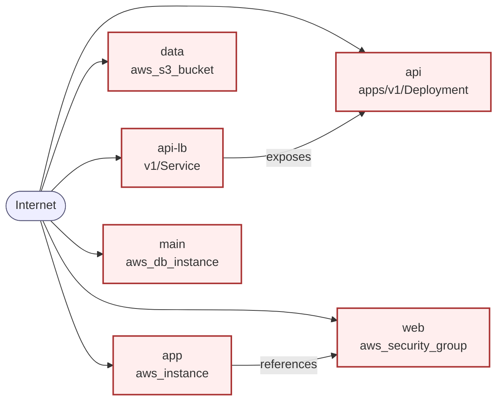

# IaC ThreatGen Report

- **Generated:** 2026-06-16T14:46:59.745211+00:00
- **Model:** `meta/llama-3.3-70b-instruct`
- **Resources:** 6 from 2 file(s); 0 skipped

## Data-flow diagram

## STRIDE threats

| ID | STRIDE | Severity | Resource | ATT&CK | Title |
|----|--------|----------|----------|--------|-------|
| TH-005 | InformationDisclosure | critical | `aws_db_instance.main` | T1530 | Publicly Accessible Database |
| TH-001 | ElevationOfPrivilege | high | `apps/v1/Deployment/api` | T1611 | Privilege Escalation in Deployment |
| TH-003 | DenialOfService | high | `aws_security_group.web` | T1499 | Unrestricted Security Group |
| TH-004 | ElevationOfPrivilege | high | `aws_instance.app` | T1552.005 | Unsecured Instance Metadata |
| TH-002 | InformationDisclosure | medium | `aws_s3_bucket.data` | T1530 | Publicly Accessible S3 Bucket |

## Details & mitigations

### TH-005 — Publicly Accessible Database (critical)
*InformationDisclosure · resource `aws_db_instance.main`*

The 'main' database instance is publicly accessible, which could allow an attacker to access sensitive data.

- **ATT&CK [T1530](https://attack.mitre.org/techniques/T1530/)** Data from Cloud Storage
- **CSF PR PR.DS-01** — Update the database instance to restrict access to authorized users

### TH-001 — Privilege Escalation in Deployment (high)
*ElevationOfPrivilege · resource `apps/v1/Deployment/api`*

The 'api' deployment has privileged set to true and allowPrivilegeEscalation set to true, which could allow an attacker to escalate privileges.

- **ATT&CK [T1611](https://attack.mitre.org/techniques/T1611/)** Escape to Host
- **CSF PR PR.AA-01** — Set privileged and allowPrivilegeEscalation to false

### TH-003 — Unrestricted Security Group (high)
*DenialOfService · resource `aws_security_group.web`*

The 'web' security group has an ingress rule that allows traffic from 0.0.0.0/0, which could allow an attacker to launch a denial-of-service attack.

- **ATT&CK [T1499](https://attack.mitre.org/techniques/T1499/)** Endpoint Denial of Service
- **CSF PR PR.AT-01** — Restrict the ingress rule to only allow traffic from authorized IP addresses

### TH-004 — Unsecured Instance Metadata (high)
*ElevationOfPrivilege · resource `aws_instance.app`*

The 'app' instance has unsecured credentials, which could allow an attacker to escalate privileges.

- **ATT&CK [T1552.005](https://attack.mitre.org/techniques/T1552/005/)** Unsecured Credentials: Cloud Instance Metadata API
- **CSF PR PR.IR-01** — Secure the instance metadata

### TH-002 — Publicly Accessible S3 Bucket (medium)
*InformationDisclosure · resource `aws_s3_bucket.data`*

The 'data' S3 bucket has a public-read ACL, which could allow an attacker to access sensitive data.

- **ATT&CK [T1530](https://attack.mitre.org/techniques/T1530/)** Data from Cloud Storage
- **CSF PR PR.DS-01** — Update the ACL to restrict access to authorized users

## Secrets detected (redacted before analysis)

- `aws_db_instance.main` attribute `password` — secret-like attribute name
